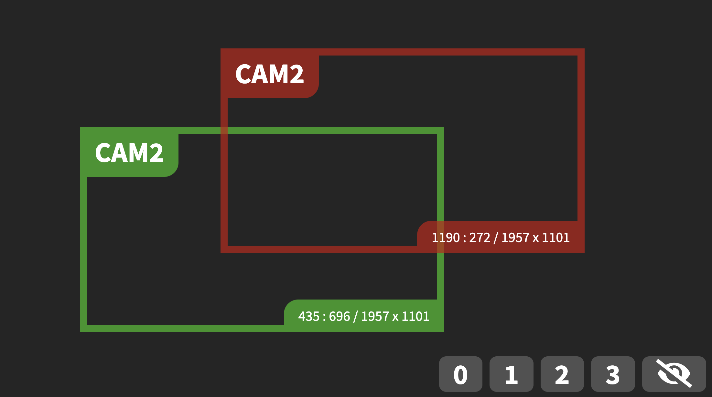
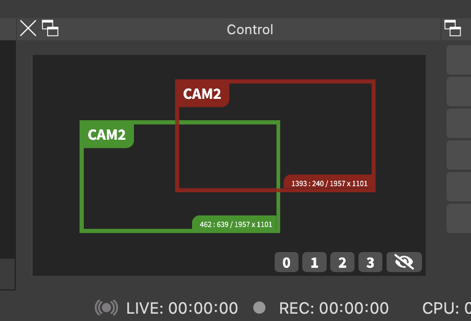

OBS-Crop-Control
================

**Remote Crop-Filter Control for OBS Studio**

About
-----

This is a small HTML5 Single-Page-Application
(SPA), running inside a Browser or directly inside a
[Source Dock](https://github.com/exeldro/obs-source-dock) of
[OBS Studio](https://obsproject.com), for interactively
controlling the position and/or size of one or more related *Crop/Pad*
source filters in [OBS Studio](https://obsproject.com) through a remote
[OBS WebSocket](https://github.com/obsproject/obs-websocket) connection.

Sneak Preview
-------------

### OBS Crop Control in a Browser

### OBS Crop Control in Source Dock of OBS Studio

Use Case
--------

The particular, original use-case for this application is the following:

- **High-Resolution Camera & Green-Screen**:
  You are using a high-resolution (4K, 3840x2160px) camera in front of
  a physical green-screen and you replace the green-screen with the
  [OBS Studio](https://obsproject.com) *Chroma-Key* source filter. In
  OBS Studio, behind your camera, you are using an arbitrary background
  image or video media (visible through the alpha channel created by the
  *Chroma-Key* filter).

- **Non-PTZ Camera Functionality**:
  Your camera is a non-PTZ (Pan-Tilt-Zoom) camera or you at least cannot
  use the available PTZ functionality of your camera because of the
  green-screen (different angles and zoom-levels would require the
  background to adjust simultanously).

- **Simulated Dynamics & Lower-Resolution Cameras**:
  You want to still somewhat simulate multiple camera angles or zooms
  by just cropping various Full-HD (1920x1080px) areas out of your 4K
  (3840x2160px) camera video with the help of the OBS Studio *Crop/Pad*
  filter. You then treat those areas as some sort of "virtual cameras".
  In order to dynamically and interactively change the *Crop/Pad*
  position and size parameters you use this control application.

Setup
-----

The particular, original setup is the following:

- You are producing your live-event with
  [OBS Studio](https://obsproject.com) as your free video streaming software.

- You have the [OBS WebSocket](https://github.com/obsproject/obs-websocket),
  [OBS Source Dock](https://github.com/exeldro/obs-source-dock) and
  [StreamFX](https://github.com/Xaymar/obs-StreamFX) extension plugins
  installed and activated in [OBS Studio](https://obsproject.com).

- You have [OBS Studio](https://obsproject.com) configured for Full-HD
  (1920x1080px) video output (see *Settings* &rarr; *Video* &rarr; *Base (Canvas) Resolution*).

- You have a scene collection in [OBS Studio](https://obsproject.com) configured,
  which contains at least the following additional scenes for your camera (here named `CAM2` as an example):

  - scene `CAM2-Full`:
    (rationale: scene for "full/total" camera view)
      - source `CAM2-Full-FG` of type *Video Capture Device*:
          - attached to your physical 4K camera device 
            (rationale: single source for physical camera)
          - filter *Chrome Key* applied
            (rationale: single filter for chroma-key)
          - transform of *Stretch to Screen* applied 
            (rationale: provide "full/total" camera view in 1080p of `CAM2-Full`)
      - source `CAM2-Full-BG` of type *Image*:
          - attached to your 4K background image 
            (rationale: single filter for chroma-key)
          - transform of *Stretch to Screen* applied 
            (rationale: provide "full/total" camera view in 1080p of `CAM2-Full`)
  - scene `CAM2-Zoom`:
    (rationale: scene for "zoomed" camera view)
      - source `CAM2-Zoom-FG` of type *Source Mirror*:
          - attached to source `CAM2-Full-FG`
            (rationale: single source for physical camera, and chroma-key already applied once and in 4K)
          - filter *Crop/Pad* applied 
            (rationale: the zoom to be applied and controlled)
          - filter *Scaling/Aspect Ratio* applied (for 1920x1080px)
            (rationale: ensure result is still Full-HD, even on arbitrary crop areas)
      - source `CAM2-Zoom-BG` of type *Source Mirror*:
          - attached to source `CAM2-Full-BG` 
            (rationale: single source for background)
          - filter *Crop/Pad* applied 
            (rationale: the zoom to be applied and controlled)
          - filter *Scaling/Aspect Ratio* applied (for 1920x1080px) 
            (rationale: ensure result is still Full-HD, even on arbitrary crop areas)

- You use this SPA in a separate Browser or directly from within OBS Studio
  with the help of the awesome [Source Dock](https://github.com/exeldro/obs-source-dock) plugin.
  The URL (show-casing all parameters) for the SPA is like the following (descriptions at the end of each line): 

  `file://[...]/obs-crop-control.html` (path to SPA) 
  `?websocket=localhost:4444` (endpoint of OBS WebSocket) 
  `&password=XXX` (authentication for endpoint of OBS WebSocket) 
  `&title=CAM2` (title of the virtual camera) 
  `&canvas=3840x2160` (size of original camera) 
  `&preview=CAM2-Full:10` (how to retrieve the original camera view and its FPS) 
  `&sources=CAM2-Zoom-FG,CAM2-Zoom-BG` (the sources of the *Crop/Pad* filters) 
  `&define=0:0+0/3860x2160,` (pre-defined total 4K area) 
  `1:0+540/1920x1080,` (pre-defined Full-HD area middle/left) 
  `2:960+540/1920x1080,` (pre-defined Full-HD area middle/center) 
  `3:1920+540/1920x1080` (pre-defined Full-HD area middle/right)

Usage
-----

- Select a crop area with a mouse left click to pick it up.
- Cancel the selection of a crop area with a mouse right click.
- Change position of crop area with mouse movement.
- Change size of crop area with mouse wheel.
- Alternatively just press the keys of the pre-defined crop areas
  to directly change selections according to pre-definition.

License
-------

Copyright &copy; 2021 [Dr. Ralf S. Engelschall](http://engelschall.com/) 
Distributed under [GPL 3.0 license](https://spdx.org/licenses/GPL-3.0-only.html)

